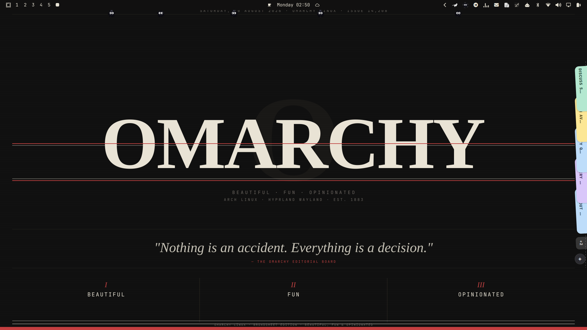

# Jot 📝

> Minimalist sticky notes living seamlessly at the edge of your screen for Omarchy / Hyprland. Inspired by macOS Noty.



## ✨ Features

- **Screen-Edge Rest Pill**: A minimal 10pt dark glass capsule resting flush at the screen edge, showing glowing color stitches for all your active notes.
- **45ms Shingled Fan Deck**: Hover over the pill to fan out vertical paper tabs with 3° subtle tilt and smooth spring physics.
- **Drag-to-Reorder**: Naturally drag tabs up and down to reorder them in the fan deck. Order is instantly persisted in SQLite.
- **Expanded Sticky Note Editor**: Click any tab to expand an authentic pastel paper note editor.
- **Interactive Checklists**: Full task checkbox support (`[ ]` open, `[✓]` completed) with click toggles and task completion counters.
- **Click-Outside & Edge Dismiss**: Click anywhere outside the note or click the edge tabs to automatically save and close the note.
- **8 Authentic Color Themes**: Lemon, Peach, Rose, Lilac, Sky, Mint, Sand, and Slate.
- **Library & Archive Manager**: Full modal manager (`Ctrl+O`) with live full-text search, active/archive views, note restoration, and Markdown/text export.
- **Top Bar Integration**: Includes a native Omarchy Top Bar widget button:
  - **Left-Click**: Toggle the edge dock visibility off/on.
  - **Right-Click**: Open the All Notes & Archive Manager.
- **100% Native Omarchy Wayland LayerShell**: Dynamic input region masking ensures full click-through to your applications underneath when resting.

---

## 🚀 Installation

### Via Omarchy Plugin Manager
```bash
omarchy plugin add jot
```

### Manual Installation
Clone this repository into your Omarchy plugins directory:
```bash
git clone https://github.com/giogio/jot.git ~/.config/omarchy/plugins/jot
```

Add `"jot"` to your `~/.config/omarchy/shell.json` configuration:
```json
{
  "bar": {
    "layout": {
      "right": [
        { "id": "jot" }
      ]
    }
  },
  "plugins": [
    { "id": "jot" }
  ]
}
```

Restart the shell to load the plugin:
```bash
omarchy-restart-shell
```

---

## ⌨️ Shortcuts & Interactions

| Action | Shortcut / Gesture |
| :--- | :--- |
| **Hover Pill** | Reveals the 45ms shingled tab deck |
| **Click Tab** | Expands note editor (or closes note if already open) |
| **Drag Tab** | Drag up/down along edge to reorder |
| **Click Outside Note** | Saves and closes open note |
| **New Note** | Click `+` button or press `Ctrl+Alt+N` |
| **All Notes / Archive** | Right-click top bar icon or press `Ctrl+O` |
| **Toggle Pin** | `Ctrl+P` |
| **Cycle Note Color** | `Ctrl+.` |
| **Delete Note** | `Ctrl+Backspace` (with 10s floating undo toast) |
| **Find in Note** | `Ctrl+F` |
| **Toggle Task / Checkbox** | Click bracket or press `Enter` on task line |

---

## 📁 Architecture

- **`manifest.json`**: Plugin specification and entry points (`panel` & `bar-widget`).
- **`Noty.qml`**: Wayland LayerShell panel controlling multi-screen dock states (Rest Pill, Fan Deck, NotePull Editor, Overlays).
- **`NotyEditor.qml`**: Note editing surface with Markdown task checklists and color palette switcher.
- **`NotyManager.qml`**: All Notes & Archive modal manager with full-text search.
- **`NotyTab.qml`**: Drag-and-drop vertical shingled tab delegate.
- **`NotyMenu.qml`**: Contextual right-click menu with clean vector glyphs.
- **`BarWidget.qml`**: Top bar button with folded-corner note icon.
- **`NotyModel.js`**: SQLite schema, Markdown conversion, and geometry engine.

---

## 📄 License

MIT © giogio
